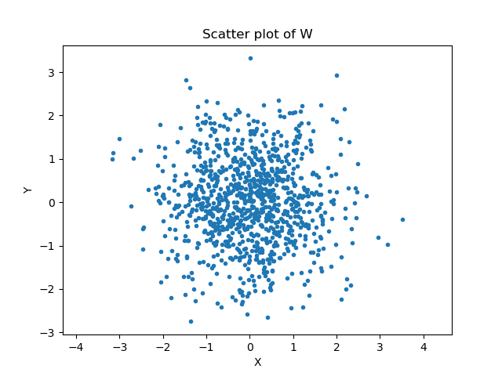
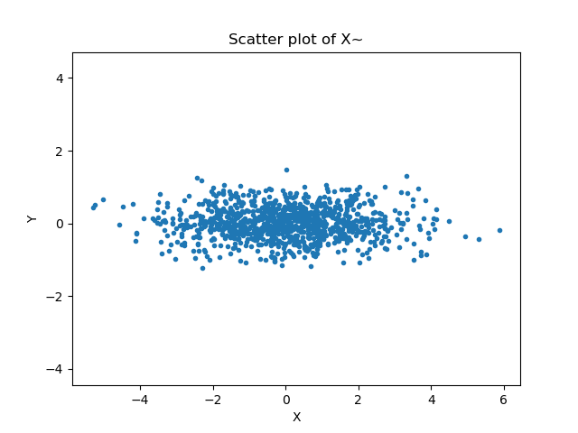
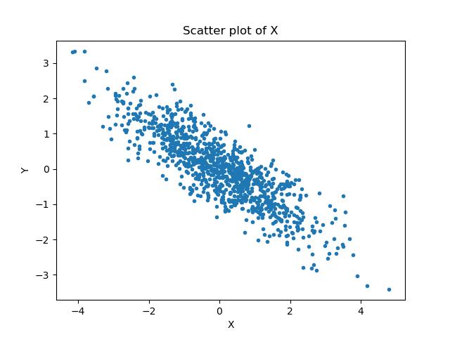
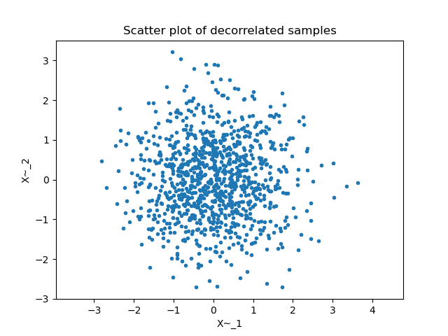
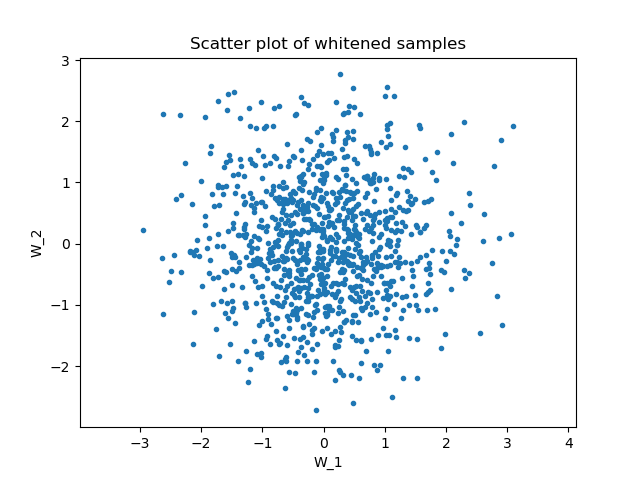
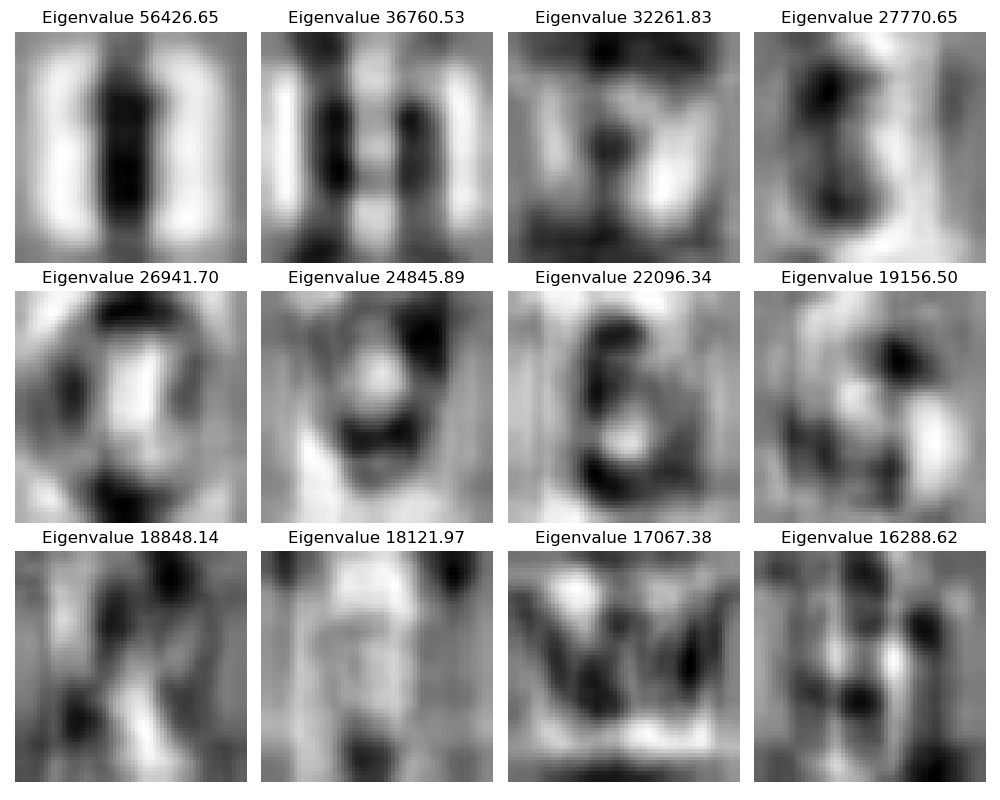
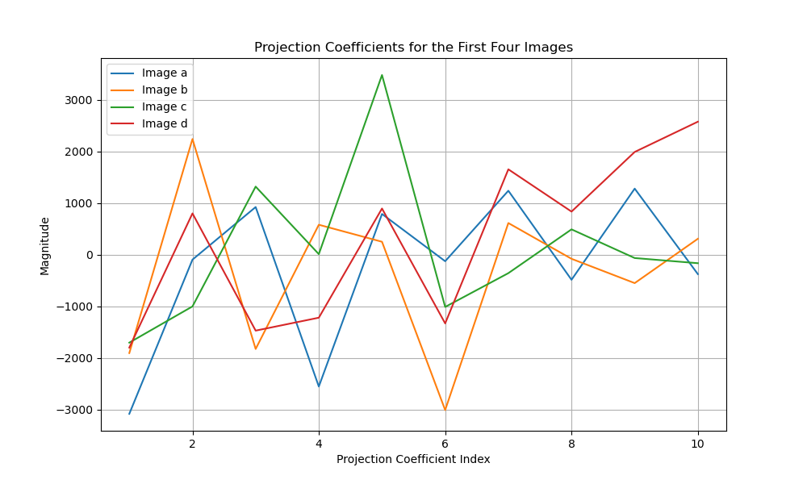
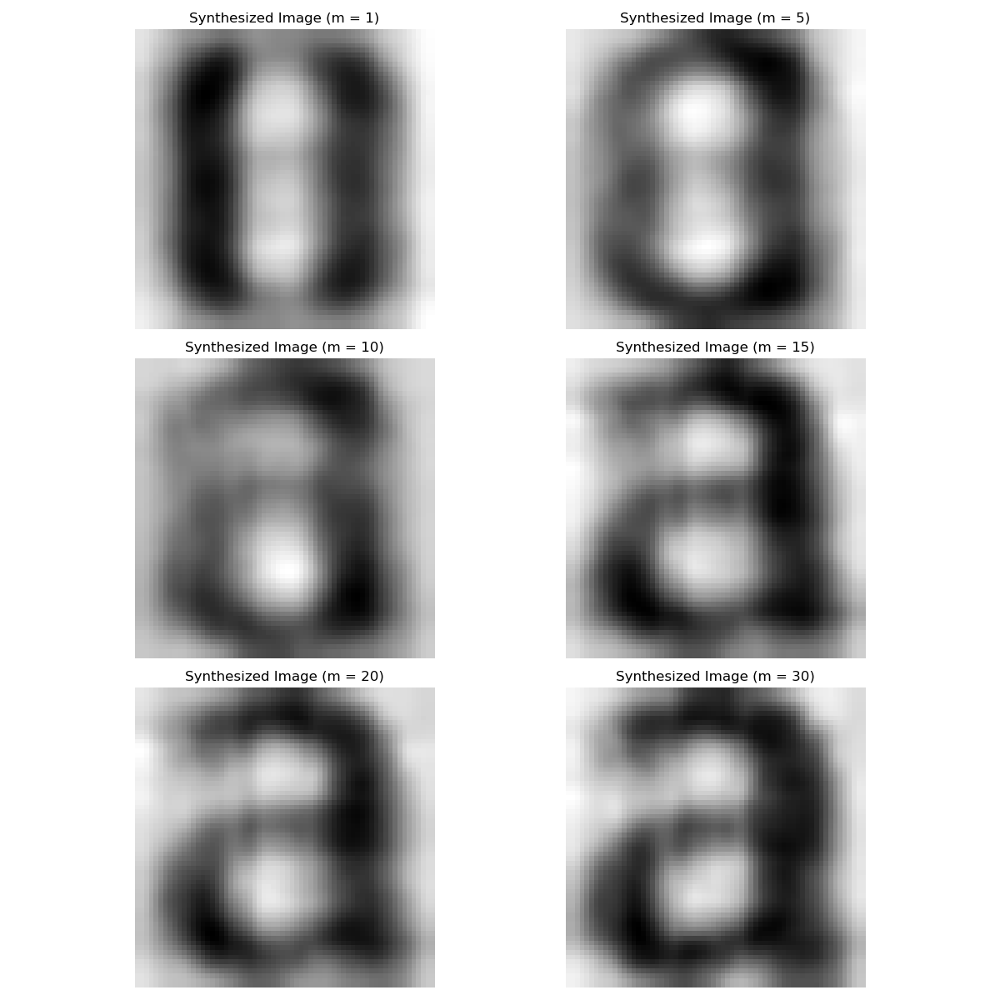
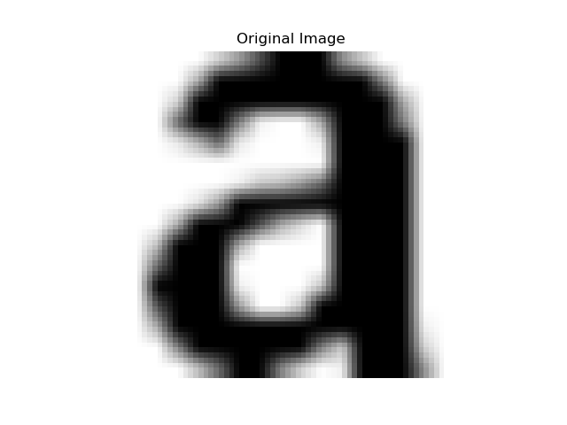

## Eigen Image Analysis

### Generating Gaussian random vectors







### Covariance Estimation and Whitening

#### Theoretical Covariance

```py
RX = [[2, -1.2],
      [-1.2, 1]]
```

#### Estimated Covariance

```py
R_hat = [[ 1.97972664 -1.16673842]
          [-1.16673842  0.94524608]]
```

#### Scatter Plots for X_tilde_i and W_i





#### Covariance estimation R_hat_W

```py
R_hat_whitened = 
    [[ 1.00000000e+00 -1.70700958e-16]
    [-1.70700958e-16  1.00000000e+00]]
 ```

### Eigenimages, PCA, and Data Reduction









### Image Classification


